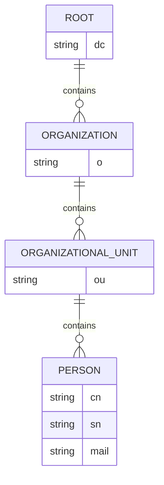
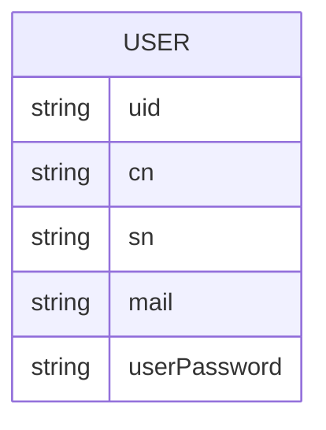

# Week 11: Lightweight Directory Access Protocol (LDAP)

## Lesson Overview

In this lesson, we will explore:

- Understanding LDAP
- Directory Services
- Characteristics of Directory Service
- LDAP Directory Servers
- LDAP Architecture and Data Model
- Object Classes
- LDAP Tree
- LDAP Operations
- LDAP Automation

---

## Introduction to LDAP

LDAP (Lightweight Directory Access Protocol) is an open protocol used to access and maintain distributed directory information services over an IP network.

- **Use Cases:** Storing and retrieving hierarchical data such as user credentials, email addresses, and network resources.
- **Model:** Follows a client-server model, typically operating over TCP/IP using port 389.
- **Security:** Secure communication via LDAPS (port 636).

---

## What is a Directory Service?

A directory service is a software system that stores, organizes, and provides access to information in a directory.

- **Centralized Repository:** Acts as a central information repository for a network.
- **Common Use Cases:** Authentication services (e.g., login), address books, employee databases.

---

## LDAP Architecture

LDAP uses a hierarchical tree structure called the **Directory Information Tree (DIT)**.

- **Entries:** Made up of object classes and attributes.
- **Distinguished Name (DN):** Uniquely identifies an entry's location in the tree.
- **Object Classes:** Define required and optional attributes for entries.

---

## LDAP Data Model - Key Concepts

| Concept         | Description                                                                 |
|-----------------|-----------------------------------------------------------------------------|
| Object Class    | Template defining required/optional attributes (e.g., person, organization)  |
| Object          | Instance of an object class                                                 |
| Schema          | Collection of rules defining object classes and attribute types              |
| Entry           | Single record in the directory (like a row in a database)                   |
| Attribute       | Information about an entry (like columns in a database)                     |
| DN              | Distinguished Name, uniquely identifies an entry                            |
| RDN             | Relative Distinguished Name, unique part of DN at a given level             |

---

## LDAP DIT Hierarchy

Think of the DIT as a tree-like structure:

- **Suffix/Base DN:** Starting point of search (e.g., `dc=example,dc=com`)

---

## Object Classes

LDAP defines three types of object classes:

- **STRUCTURAL:** Mandatory for each entry; defines the core structure.
- **AUXILIARY:** Adds additional attributes to an entry.
- **ABSTRACT:** Provides a base class for inheritance.

> Example: `inetOrgPerson` is a structural object class commonly used for representing people.

---

## Schema

A schema is a collection of definitions for object classes and attributes.

- **Examples:**
  - `core.schema`: Basic directory elements
  - `inetorgperson.schema`: Common user attributes
  - `nis.schema`: Unix account fields
- **Extensible:** Schemas can be extended as needed.

---

## LDAP Server Implementation

### Directory Services

LDAP server consists of two main parts:

- **Front End:** Handles protocol communication with LDAP clients.
- **Backend:** Handles database operations.

> The Linux implementation of LDAP is **OpenLDAP** (`slapd` service).

### LDAP Server Configuration

- **Global Configuration:** Applies to the LDAP server as a whole (all backends).
- **Database Backend Definitions:** Information specific to a backend instance.

> Note: `slapd` supports various database backends.

---

## OpenLDAP Setup

1. **Install OpenLDAP packages**
2. **Setup the server**
   - **Deprecated:** `/etc/openldap/slapd.conf`
   - **Current:** `/etc/openldap/slapd.d/*` (stores configuration in a dedicated DIT)
3. **Upload directory information**
   - Migrate existing data using migration tools
   - Bulk-load new entries using LDIF files & LDAP tools
4. **Test server availability and directory access**

---

## OpenLDAP Configuration (Deprecated)

The `slapd.conf` file consists of:

- **Global Directives:** Server values (e.g., loglevel), schema files, default access control
- **Database Directives:** Database instance type, LDAP admin & password, suffix, indexing, replication, access control

---

## Example: User Account Object Schema

---

## Lab Instructions

_Follow the provided lab instructions to practice LDAP setup and configuration._

---

> **Ready to upload to GitHub:**  
> - Structured with headings and sections  
> - Includes Mermaid ER diagrams for DIT and schema  
> - Markdown formatting for readability  
> - Suitable for documentation or course notes
